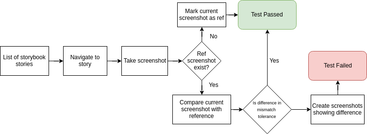

# Visual Regression for Storybook
## Overview
The purpose of this repository is to show functionality of visual regression using WebDriver libraries, it gives us possibility to run tests on every browser/devices/services(i.e Browserstack) which implements WebDriver API.

### Technology
* [WebdriverIO](https://github.com/webdriverio/webdriverio/)
* [wdio-visual-regression-service](https://github.com/zinserjan/wdio-visual-regression-service)

Additional (optional):
* [Graphicsmagic](https://www.imagemagick.org/script/index.php)
* [Docker](https://www.docker.com/);

### Flow
Visual regression testing flow related to storybook


## Run
We have two ways to run those tests
* Docker (simple one)
* localy

### Docker
#### Prerequisities:
* Docker & Docker-Compose (>1.18.0);

#### Run
Build images:
```sh
docker-compose build
```
Run tests
```sh
docker-compose run vrtest
```
Cleanup
```sh
docker-compose down
```

### Local
#### Prerequisities:
* NodeJS
* Java (for selenium-standalone npm package)
* Graphicsmagic* (Optional only for performance)

Build and start storbook:
```sh
cd ./storybook/backpack-ui
npm install
npm run build-storybook
npm run storybook
cd ../..
```
Build and start tests
```sh
npm install
npm test
``` 